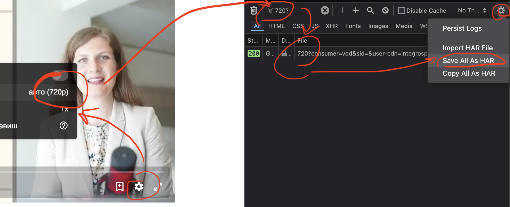
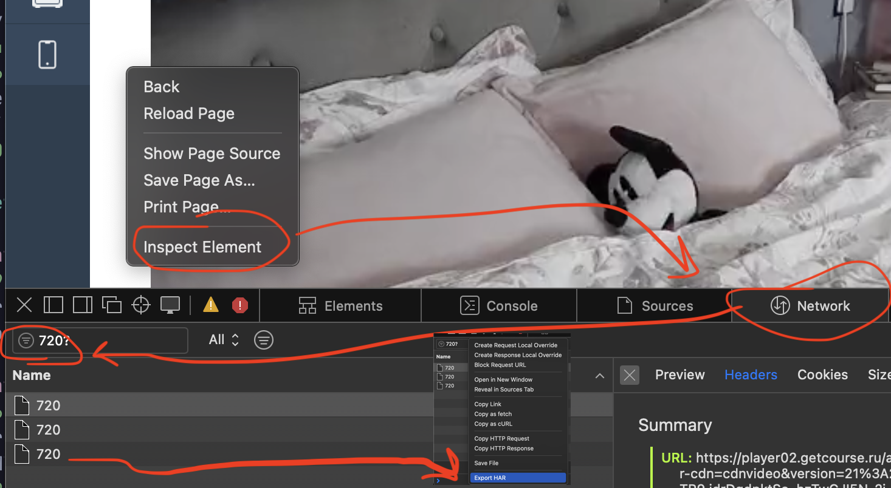

# GetCoursePythonDownloader

Форк с поддержкой загрузки ссылок из [.har](https://en.wikipedia.org/wiki/HAR_(file_format)) файла и запуском через [uvx](https://docs.astral.sh/uv/#tool-management)

## Запуск без установки:

`uvx --from git+https://github.com/Dimentium/GetCoursePythonDownloader getcourse`

## Установка для запуска командой `getcourse`: 

`uv tool install git+https://github.com/Dimentium/GetCoursePythonDownloader`

## Аргументы

- `-a` - обработка всех `*.har` файлов в текущей директории - после обработки файл переименовывается в `*.har.done`
- `-f <name_of_har_file>` - скачивание ссылок из конкретного `.har` файла - после обработки файл НЕ переименовывается

## Как получить .har файл

### Firefox



### Safari



# Оригинальное описание

Этот скрипт предназначен для загрузки видео с платформы GetCourse и основан на [этом скрипте](https://github.com/mikhailnov/getcourse-video-downloader). Он загружает сегменты видео, объединяет их и конвертирует в формат MP4.

## Особенности

- Асинхронная загрузка сегментов видео
- Прогресс-бары для отслеживания загрузки
- Автоматическое объединение сегментов
- Конвертация в MP4 с использованием FFmpeg
- Поддержка повторных попыток при ошибках загрузки и конвертации

## Требования

- Python 3.7+
- FFmpeg
- Библиотеки Python: aiohttp, tqdm

## Установка

1. Клонируйте репозиторий:
   ```
   git clone https://github.com/your-username/getcourse-video-downloader.git
   cd getcourse-video-downloader
   ```

2. Установите необходимые библиотеки:
   ```
   pip install aiohttp tqdm
   ```

3. Убедитесь, что FFmpeg установлен и доступен в системном PATH или находится в одной папке со скриптом.

## Использование

Запустите скрипт:

```
python gcpd.py
```

Следуйте инструкциям в командной строке:

1. Введите ссылку на плейлист.
2. Укажите имя выходного файла.

Дополнительные опции:

- `-npd` или `--no-pre-download`: Пропустить предварительную загрузку размеров файлов.

Пример:
```
python gcpd.py --no-pre-download
```

-  Возможность определить количество параллельных потоков

Пример:
Меняя
```
MAX_PARALLEL_DOWNLOADS = 4 
```
на
```
MAX_PARALLEL_DOWNLOADS = 5
```
Мы, соотвественно, меняем количество параллельных потоков закгрузки с 4 на 5.
## Решение проблем

Если возникают проблемы с загрузкой или конвертацией, скрипт автоматически попытается повторить операцию. Если проблема сохраняется, проверьте:

1. Правильность ссылки на плейлист.
2. Наличие доступа к интернету.
3. Корректность установки FFmpeg.
4. Свободное место на диске.

## Вклад в проект

Если вы обнаружили ошибку или у вас есть предложения по улучшению, пожалуйста, создайте issue или pull request в репозитории проекта.

